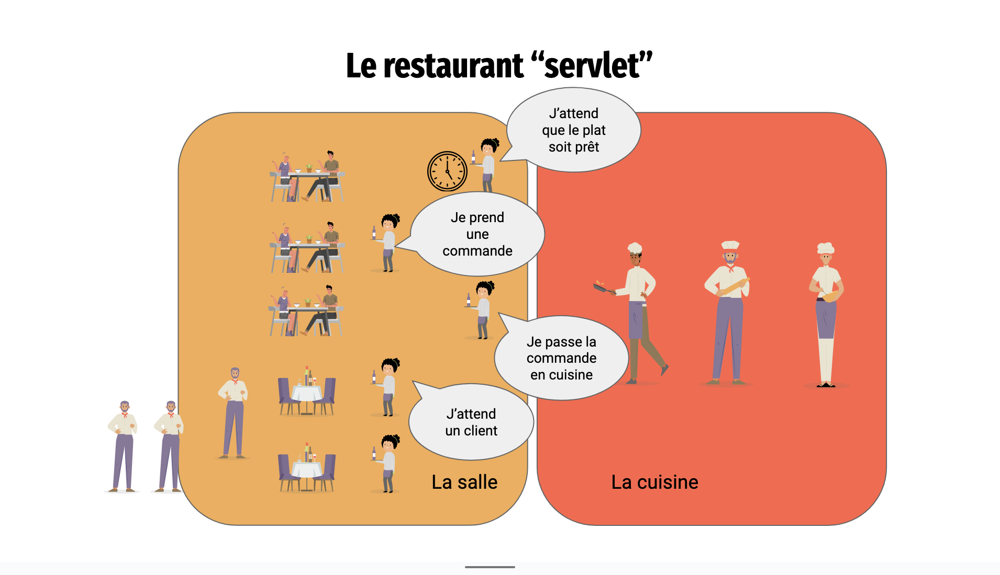
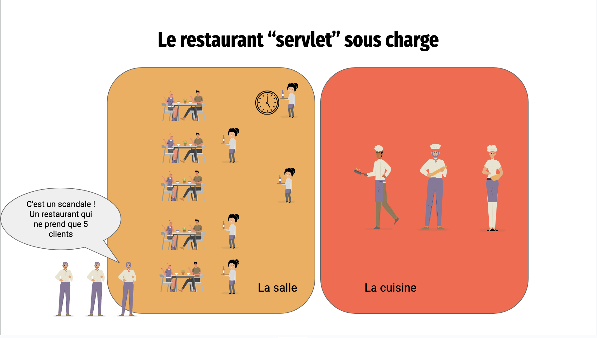
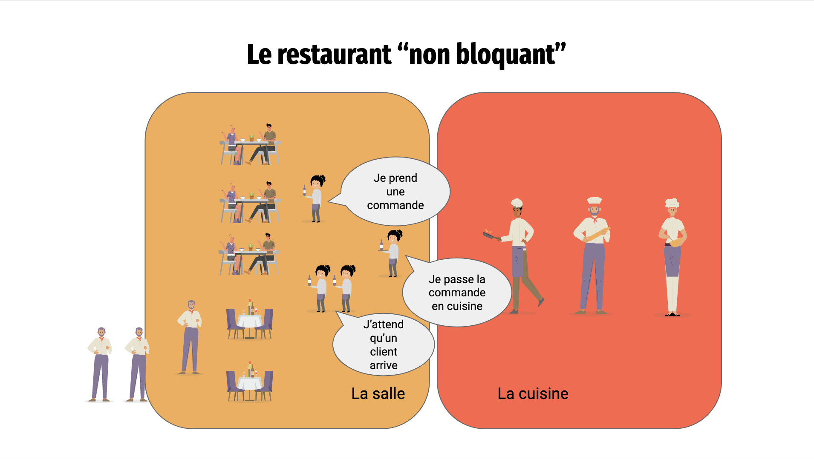
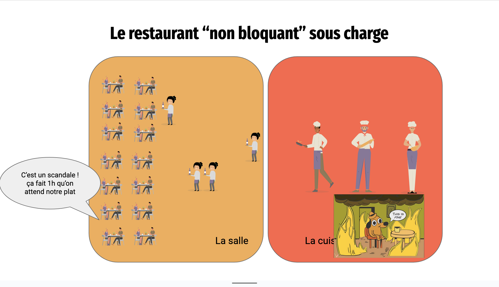
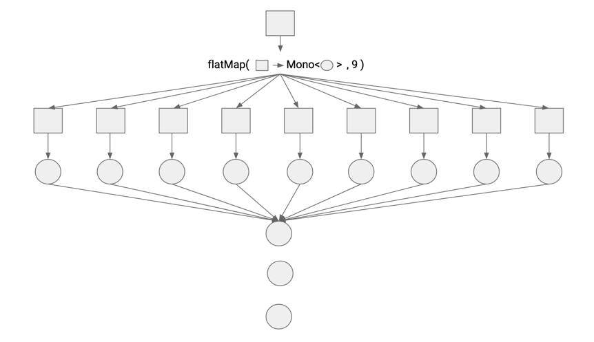

# Reactor sous le capot 

## Les différents modèles d'exécution:  

Pour illustrer les différents modèles d'exécution, on va utiliser l'image du restaurant ou : 
* la salle : l'application
* la cuisine : la base de données
* un serveur : un thread 
* les clients / une table : une requête 

### Servlet 



Dans le monde servlet nous aurons un server par table. 
Le server va 
* accueillir le client
* le placer
* attendre sa commande 
* passer sa commande en cuisine 
* attendre ses plats 
* encaisser le paiement 

Une fois tout ça, il pourra passer au client suivant. Dans cette hypothèse, le serveur passe beaucoup de temps à attendre. 

Sous charge, quand tous les serveurs sont occupés, les clients doivent attendre : 



### Mode non bloquant

Dans le mode non bloquant, on ne bloque pas le thread lors des IOs. Le thread est libéré pour effectuer d'autres taches. 

En mode restaurant, c'est ce qu'on connait, des servers qui passent de client en client. 



Sous charge, on peut imaginer servir un nombre de tables vraiment important, ici c'est la cuisine qui va galérer car si elle est trop lente, les commandes vont s'accumuler. 



### Reactive stream 

Dans la spec reactive stream, il y a une gestion de "back pressure" autrement appelé "flow control". 

Dans le cas du restaurant, c'est la cuisine qui va piloter la charge en fonction de sa capacité. 

Sous charge, on être dans le même cas que servlet, les clients vont faire la queue. Par contre on utilise un nombre de serveur (thread) limité.


## Dans spring reactor 

Spring reactor propose des `Flux` et des `Mono` : 
* `Mono` un résultat (ou pas de résultat) qui n'est pas encore là 
* `Flux` une collection d'éléments qui vont arriver au fur et à mesure

Pour illustrer les mécanismes de back pressure, on va s'intéresser aux `Flux`. 

Un `Flux<T>` va émettre des éléments de type `T`, il existe tout un tas d'opérateurs qui vont nous permettre de filtrer (`filter`), transformer (`map`, `flatMap`, `concatMap` ...), grouper (`buffer`, `bufferTimeout`, `scan` `reduce` ...), ajouter du délai (`delayElements`) etc, un peu comme les streams du JDK.    

La différence entre le JDK et reactor, c'est que dans les reactor les éléments arrivent au fur et à mesure, on est dans un push plutôt que pull. 

Une autre différence importante, c'est qu'un flux n'est qu'un plan d'exécution. Tant qu'on a pas fait `subscribe` rien ne se passe.
C'est la différence majeure entre `Mono` et `CompletionStage`, un `CompletionStage` est déjà exécuté et on attend le résultat, ça n'est pas le cas pour un `Mono` qui est "lazy".  

Nous allons implémenter un `Flux` custom : un compteur. Pour faire on va utiliser `create` qui va nous donner un `sink` qui permettra de piloter nos actions

```java
Flux<Long> counterFlux = Flux.create(sink -> {
    AtomicLong counter = new AtomicLong(0);
    // onRequest : le consommateur du stream nous demande n éléments 
    sink.onRequest(req -> {
        System.out.println("Request " + req);
        // On produit les n éléments en incrémentant notre compteur : 
        for (int i = 0; i < req; i++) {
            // On utiliser sink.next pour publier les éléments downstream 
            sink.next(counter.incrementAndGet());
        }
    });
    // Do on cancel
    sink.onCancel(() -> {
        System.out.println("Cancel");
    });
    // Do on terminate
    sink.onDispose(() -> {
        System.out.println("Terminate");
    });
});
```

Maintenant on va pouvoir constater l'impact des opérateurs sur la gestion de la backpressure à travers la demande. 

### Un simple abonnement 

```java
counterFlux
        .subscribe(
            n -> {
                System.out.println("Next valeur = " + n);
            },
            e -> {
                e.printStackTrace();
            },
            () -> {
                System.out.println("Complete");
                cdl.countDown();
            }
        );
```

Ici on va s'abonner au flux et donc l'executer. On aura les logs suivant : 

```
Request 9223372036854775807
Next valeur = 1
Next valeur = 2
Next valeur = 3
Next valeur = 4
...
```

Ici aucune raison de réguler la vitesse du flux, la demande est `Long.MAX_VALUE` à savoir 9223372036854775807. 

### Take 

L'opérateur take permet de ne prendre que les n premiers éléments et de stopper le stream. 

```java
counterFlux
        .take(5)
        .subscribe(
            n -> {
                System.out.println("Next valeur = " + n);
            },
            e -> {
                e.printStackTrace();
            },
            () -> {
                System.out.println("Complete");
                cdl.countDown();
            }
        );
```

On aura les logs suivants 
```
Request 5
Next valeur = 1
Next valeur = 2
Next valeur = 3
Next valeur = 4
Next valeur = 5
Complete
Cancel
Terminate
```

Ici on voit que la demande a été adapté par l'opérateur take. 
La demande remonte du consommateur vers le producteur, `subscribe` demande `Long.MAX_VALUE` mais la demande est overridé par `take` qui lui ne demande que le nombre nécessaire, ici 5.

`take` demande 5, la source publie 5 éléments, puis le stream est terminé.

### Delay 

L'opérateur delay va ajouter un délai entre chaque élément, voyant comme se comporte cet opérateur. 

```java
counterFlux
        .delayElements(Duration.ofSeconds(1))
        .subscribe(
            n -> {
                System.out.println("Next valeur = " + n);
            },
            e -> {
                e.printStackTrace();
            },
            () -> {
                System.out.println("Complete");
                cdl.countDown();
            }
        );
```

```
Request 1
Next valeur = 1
Request 1
Next valeur = 2
Request 1
Next valeur = 3
Request 1
Next valeur = 4
Request 1
Next valeur = 5
Request 1
Next valeur = 6
Request 1
Next valeur = 7
...
```

Ici on voit qu'une demande de 1 est formulée pour chaque élément. 
Comme un délai est inséré entre chaque élément, l'opérateur délai ne demande qu'1 seul élément. 
Ceci permet de contrôler la conso mémoire en ne demandant que ce qui est nécessaire.  

Si on combine avec buffer (opérateur qui permet de faire des paquet de n élément), on peut avoir des comportements différents suivant l'ordre dans lesquels les opérateurs sont placés : 

```java
counterFlux
    .buffer(4)
    .delayElements(Duration.ofSeconds(1))
    ...
```

```
Request 4
Next valeur = [1, 2, 3, 4]
Request 4
Next valeur = [5, 6, 7, 8]
Request 4
Next valeur = [9, 10, 11, 12]
Request 4
Next valeur = [13, 14, 15, 16]
...
```
Ici delayElements demande 1 élément mais la demande est surchargée par buffer qui en demande 4. 

à l'inverse 

```java
counterFlux
    .buffer(4)
    .delayElements(Duration.ofSeconds(1))
    ...
```
buffer demande 4 élément mais la demande est surchargée par delayElements qui en demande 1. On peut observer ça dans les logs : 

```
Request 1
Request 1
Request 1
Request 1
Next valeur = [1, 2, 3, 4]
Request 1
Request 1
Request 1
Request 1
Next valeur = [5, 6, 7, 8]
...
```

### flatMap

L'opérateur `flatMap` permet de faire de la composition. Comme `map` il permet d'appliquer une fonction sur chaque élément à la différence que le résultat de la fonction sera lui même un stream. 

Pour illustrer ça, on peut imagine un Flux d'identifiants et pour chaque id on va appeler une API (c'est IO et donc un Flux ou Mono). 

On pourrait avoir quelque chose comme : 

```java
Flux<ID> ids = services.listIds();
Flux<Personne> personnes = ids
        .flatMap(id -> {
            Mono<Personne> personne = getPersonneById(id);
            return personne;
        });
```

Voyons maintenant comme se comporte `flatMap` sur la demande. On se concentre uniquement sur la gestion de la demande donc pas besoin de faire un appel compliqué, on juste retourner l'élément courant. 

```java
counterFlux
    .flatMap(elt -> 
            // On ajoute un délai de 1 seconde pour symboliser un appel d'api 
            Mono.just(elt).delayElement(Duration.ofSeconds(1))
    )
```

Résultat : 

```
Request 256
Next valeur = 2
Request 1
Next valeur = 10
Request 1
Next valeur = 18
Request 1
Next valeur = 26
Request 1
Next valeur = 34
Request 1
Next valeur = 42
Request 1
Next valeur = 50
Request 1
Next valeur = 58
Request 1
Next valeur = 66
```

😱 mais que se passe t-il ?!? 
1. On voit que la requête est de 256 !!! 
2. On voit que les éléments arrive dans le désordre 

En fait par défaut flatMap cherche à paralléliser ses traitements et la valeur de la demande par défaut c'est 256. 
Si on appelait une API, on ferait 256 appels concurrent, et les résultats seraient entremêlés !



Ce n'est pas forcément le comportement souhaité par la plupart des utilisateurs ! Donc attention ! 

Pour ne faire qu'un traitement à la fois il existe `concatMap` :  
```java
counterFlux
    .concatMap(elt -> 
            // On ajoute un délai de 1 seconde pour symboliser un appel d'api 
            Mono.just(elt).delayElement(Duration.ofSeconds(1))
    )
```

On a alors : 

```
Request 1
Next valeur = 1
Request 1
Next valeur = 2
Request 1
Next valeur = 3
Request 1
Next valeur = 4
Request 1
Next valeur = 5
```